# Discord_ExamBot
1. 創立bot 
https://discord.com/developers/applications  
a. General Information: 就設定你bot的名稱等  
b. Bot: 在Bot選項中有Token 請記住它等等會用到 如果忘了就Reset會給新的  
Presence Intent, Server Members Intent, Message Content Intent 三個要打開  
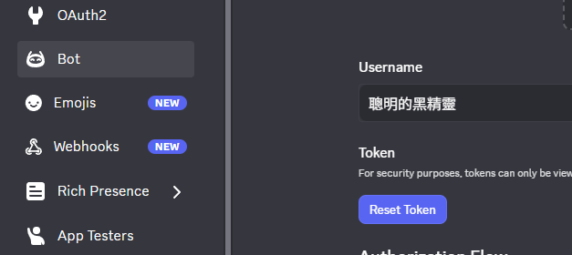  
c. Installation: 滑到最底下 Scopes新增一個bot  
Guild Install新增ManageRoles SendMessage ViewChanels (我不太確定Manage Channel要不要 有問題再說) 
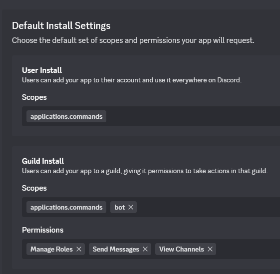  
好了之後往上滑的Install Link直接貼在新的分頁  
然後新增到你要的伺服器中(要有權限 我不確定是哪一個 不過管理員能直接加)
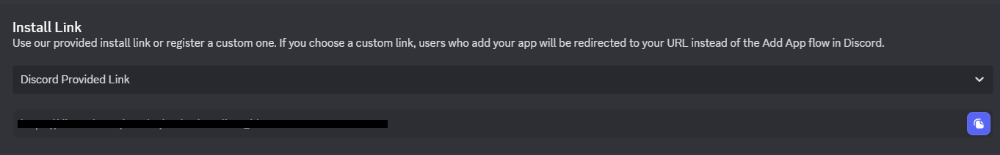
2. github  
將我的儲存庫的code 弄一份副本在你的儲存庫(圖右上角)  
然後打儲存庫的名稱就能新增了
  
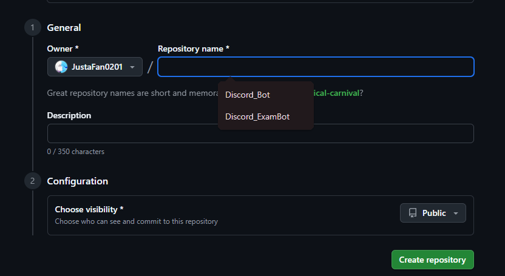
3. 架設bot
用剛剛的github帳號在 https://render.com/ 註冊帳號  
註冊好後再右上角選Postgres 輸入名稱跟選專案庫加進去 然後底下方案選free  
好了之後會出現在專案庫裡面 我的叫做quiz_db  
點進去後 右上角connect的external 記住第一行URL的內容  
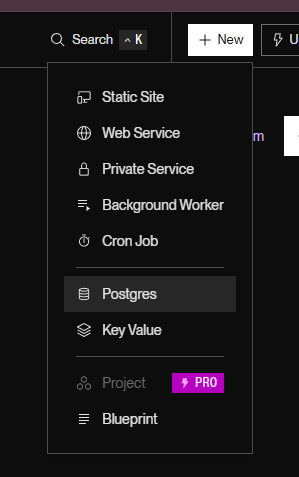  
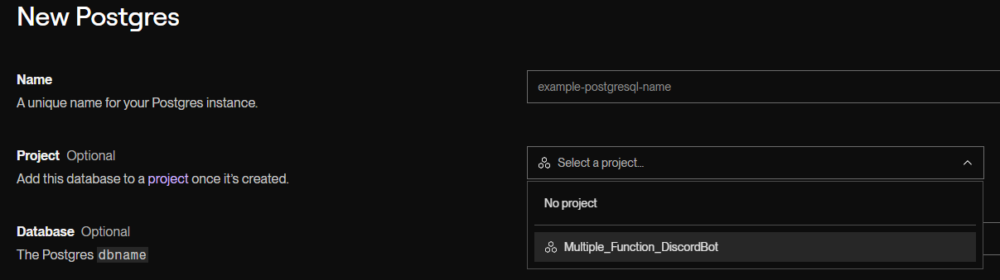
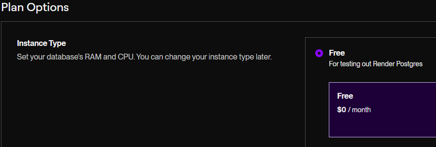
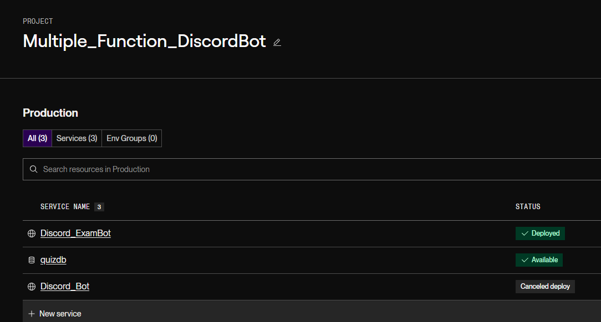
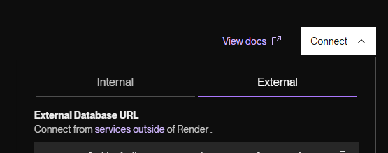  
以上是儲存題庫的資料庫  
好了之後回到主頁新增Web service  
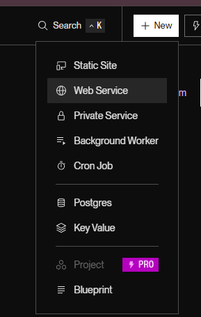  
點擊剛剛在github新增的儲存庫  
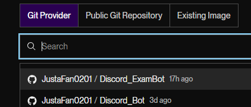  
選擇跟剛剛一樣的專案庫  
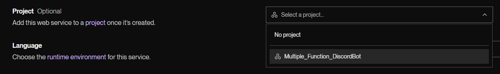  
然後底下Start command輸入

   ```bash
   python bot.py
   ```  
   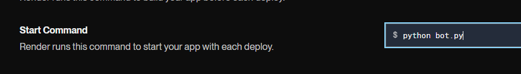  
底下方案一樣選free  
最底下的Environment Variables新增   
DISCORD_BOT_TOKEN=剛剛的BotToken  
EXTERNAL_DATABASE_URL=剛剛Postgres的URL  
好了之後進去專案  
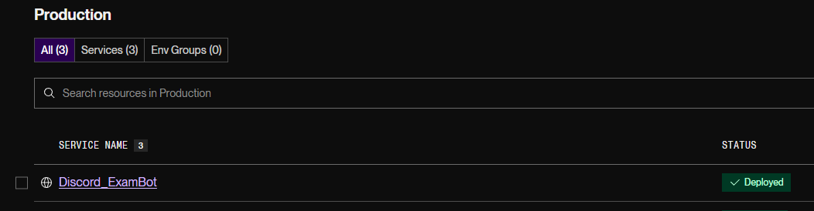
右上角第一個就是部屬到伺服器了  
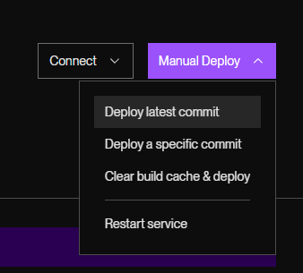  
4. 監控
因為只要你網頁關掉後幾分鐘 bot就會下線了  
所以先在 https://uptimerobot.com/ 註冊
在右上角新增Single  
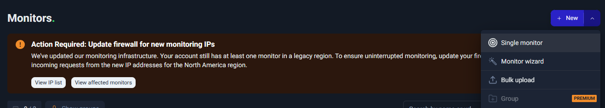  
然後在URL輸入剛剛 伺服器頁面我圖片中塗白部分  

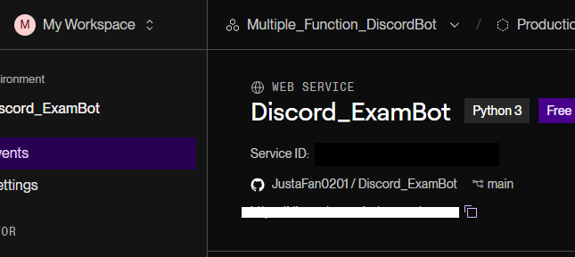  
然後email看你要不要收  
Monitor interval延遲拉5mins   
大概就這樣  

5. 身分組  
把機器人身分組拉的比你要給的身分組高  
沒了 有問題再找我  
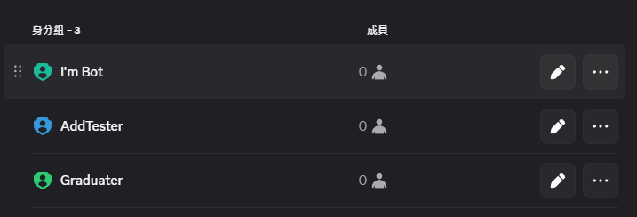
